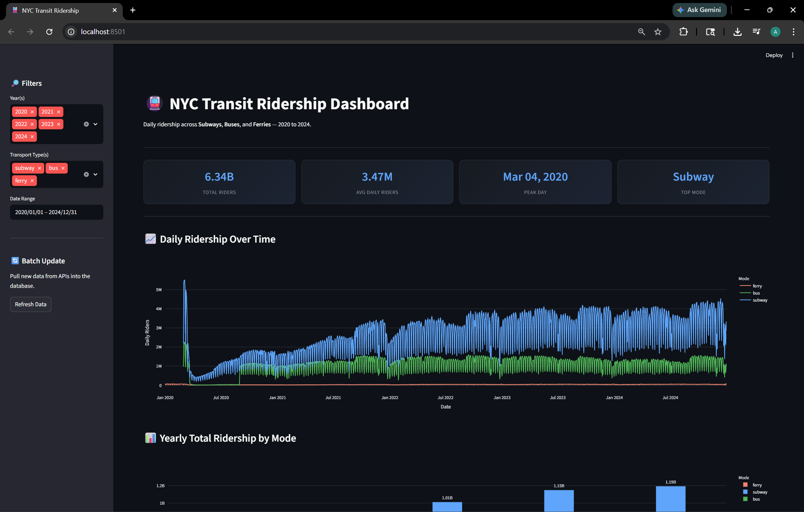

# NYC Transit Ridership Pipeline

A full-stack data engineering pipeline that ingests, cleans, stores, and visualizes
New York City transit ridership data across Subways, Buses, and Ferries (2020–2024).

## APIs Used

| Source | Data |
|--------|------|
| [MTA Ridership Data (data.ny.gov)](https://data.ny.gov/resource/vxuj-8kew) | Subway & Bus daily ridership |
| [NYC Ferry Ridership (data.cityofnewyork.us)](https://data.cityofnewyork.us/resource/6eng-46dm) | Ferry daily ridership |

## Project Structure

```
term_project/
├── extract.py               # Fetches data from APIs
├── transform.py             # Cleans and transforms raw data
├── load.py                  # Loads cleaned data into PostgreSQL
├── streamlit_app.py         # Interactive Streamlit dashboard
├── Dockerfile               # Container image for ETL + Streamlit
├── docker-compose.yml       # Orchestrates all services
├── requirements.txt         # Python dependencies
├── .env.sample              # Sample environment variables
├── NewYork_transportations.csv  # Cleaned and combined dataset
├── NYC_ERD.png              # Entity-relationship diagram
└── README.md
```

## PostgreSQL Setup

The database is automatically created and populated when you run `docker-compose up --build`. No manual setup is required.

Three tables make up the schema:

- **transport_types** — lookup table of transit modes (subway, bus, ferry). Contains `transport_type_id` (SERIAL PRIMARY KEY) and `transport_type` (VARCHAR(20)).
- **daily_ridership** — daily ridership counts per transport type. Contains `id`, `date` (DATE), `ridership` (NUMERIC), `transport_type` (FK to transport_types), and `year` (INTEGER).
- **yearly_ridership** — aggregated yearly totals per transport type, auto-refreshed on every load. Contains `id`, `year` (INTEGER), `transport_type` (FK to transport_types), and `total_ridership` (NUMERIC).

The `daily_ridership` and `yearly_ridership` tables use unique indexes on `(date, transport_type)` and `(year, transport_type)` respectively to prevent duplicate entries.

See `NYC_ERD.png` for the full entity-relationship diagram.

## How to Run

### 1. Clone the repository
```bash
git clone https://github.com/AJtheAggie/DAEN-328-Term-Project.git
```
Then open the cloned folder in your terminal.

### 2. Set up your environment variables
- Find the `.env.sample` file in the project folder
- Make a copy of it and rename the copy to `.env`
- Open `.env` and fill in your database credentials:
```
DB_NAME=your_database_name
DB_USER=your_postgres_user
DB_PASSWORD=your_password
DB_HOST=db
DB_PORT=5432
```

### 3. Build and start all services
```bash
docker-compose up --build
```

This single command will automatically:
- Start a **PostgreSQL** container (empty database)
- Run the **ETL pipeline** (extract → transform → load) to populate the database
- Launch the **Streamlit dashboard** once the data is ready

### 4. Open the dashboard
Visit [http://localhost:8501](http://localhost:8501) in your browser.

## Streamlit Dashboard

The dashboard includes:
- **5 interactive visualizations** — daily ridership over time, yearly totals by mode,
  ridership share (pie chart), average ridership by month, and year-over-year % change
- **Sidebar filters** — filter by year, transport type, and date range
- **Batch update button** — pulls fresh data directly from the NYC APIs and updates the database

## Screenshot



## Group Members & Contributions

| Name | Contribution |
|------|-------------|
| AJ | Data ingestion & cleaning (`extract.py`, `transform.py`) |
| Sreesh | Database schema design (ERD), PostgreSQL setup (`load.py`) |
| Altar | Streamlit dashboard, Dockerfile, Docker Compose, batch update mechanism, run behavior |
